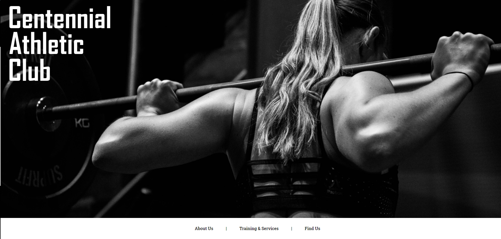

# Fictional Fitness Club
> The focus of this project was to create a website for a fictional fitness club homepage uing the CSS Flexbox layout. The use of flexbox and a little responsive CSS creates a seemless look on all devices. I built this as part of the Full Stack Engineer Career Path on [Codecademy](https://www.codecademy.com/learn). Please share any feedback regarding this project! Happy coding!

## Table of Contents
* [General Info](#general-information)
* [Technologies Used](#technologies-used)
* [Features](#features)
* [Screenshots](#screenshots)
* [Setup](#setup)
* [Usage](#usage)
* [Project Status](#project-status)
* [Room for Improvement](#room-for-improvement)
* [Acknowledgements](#acknowledgements)
* [Contact](#contact)
<!-- * [License](#license) -->

## General Information
- Project created as part of the Full Stack Engineer Career Path on [Codecademy](https://www.codecademy.com/learn)
- Created using the CSS Flexbox model
- The use of media queries and responsive CSS creates a seemless look on all devices

## Technologies Used
     

## Features
- CSS Flexbox & Grid
- Mobile Device Responsive
- Scrolling menu with JS to fix it and put it back depending on users scroll position
- Image slideshow

## Screenshots

<!-- If you have screenshots you'd like to share, include them here. -->

## Setup
- Live-version of the project can be found @ https://chrisdecleene.github.io/fictionalFitnessClub/
- Project is available on [GitHub](https://github.com/ChrisDeCleene/fictionalFitnessClub)

## Project Status
Project is: _in progress_

## Room for Improvement
Room for Improvement:
- Menu dropdown using JS instead of only CSS.
- Add Google Maps for locations in addition to existing boxes.

To Do List:
- Improve spacing of boxes in locations section to fill larger screens better.
- Add hamburger menu with subsections for mobile devices.
- Add more images to the site slider with equipment examples instead of application.
- Make slideshow autoplay.
- Add individual pages for each Training and Services section.

## Acknowledgements
- This project was made with [Codecademy](https://www.codecademy.com/) as part of the Full Stack Engineering Career Path

## Contact
Created by [Chris DeCleene](https://chrisdecleene.github.io/) - feel free to contact me!

<!-- Optional -->
<!-- ## License -->
<!-- This project is open source and available under the [... License](). -->